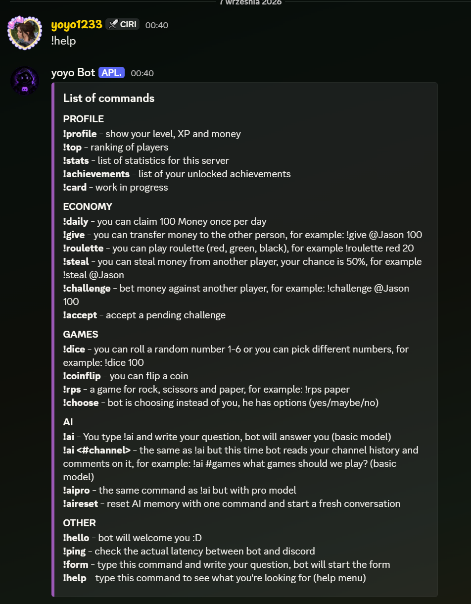

# Yoyo Bot

Discord bot with a leveling system, custom currency, games and AI integration.

## Features

- 📈 **Leveling system** - Leveling system with XP and level-up rewards
- 💰 **Economy system** - currency earned through activity and daily rewards, spent on games and transfers between players
- 🎮 **Games** - dice, coinflip, rock-paper-scissors, roulette
- 🤖 **AI** - DeepSeek, two models, conversation memory, channel context
- 🏆 **Achievements** - three achievements to unlock

## Requirements
- Python 3.10+
- discord.py
- openai
- python-dotenv

## Setup
1. Clone the repository:
```
git clone https://github.com/KubaZx/Yoyo-Bot.git
```
2. Install dependencies: 
```
pip install discord.py openai python-dotenv
```
3. Create a `.env` file and add your tokens:
```
DISCORD_TOKEN=your_token_here
DEEPSEEK_API_KEY=your_key_here
```
4. Run the bot:
```
python bot.py
```

## Commands
### Profile
| Command         | Description |
|-----------------|-------------|
| `!profile`      |show your level, XP and money|
| `!top`          | ranking of players|
| `!stats`        | list of statistics for this server|
| `!achievements` | list of your unlocked achievements|
| `!card`         | work in progress|

### Economy
| Command | Description                                                               |
|---------|---------------------------------------------------------------------------|
| `!daily`| you can claim 100 Money once per day                                      |
| `!give` | you can transfer money to the other person, for example: !give @Jason 100 |
| `!roulette` | you can play roulette (red, green, black), for example !roulette red 20|
| `!steal` |  you can steal money from another player, your chance is 50%, for example !steal @Jason|
| `!challenge` | bet money against another player, for example: !challenge @Jason 100|
| `!accept` | accept a pending challenge|

### Games
| Command | Description|
|---------|------------|
| `!dice` | you can roll a random number 1-6 or you can pick different numbers, for example: !dice 100|
| `!coinflip` | you can flip a coin|
| `!rps` | a game for rock, scissors and paper, for example: !rps paper|
| `!choose` |  bot is choosing instead of you, he has options (yes/maybe/no)|

### AI
| Command | Description                                                                                                                                       |
|---------|---------------------------------------------------------------------------------------------------------------------------------------------------|
| `!ai` | you type !ai and write your question, bot will answer you (basic model)                                                                           |
| `!ai <#channel>` | the same as !ai but this time bot reads your channel history and comments on it, for example: !ai #games what games should we play? (basic model) |
| `!aipro` | the same command as !ai but with pro model                                                                                                        |
| `!aireset` | reset AI memory with one command and start a fresh conversation                                                                                   |

### Other
| Command | Description|
|---------|------------|
| `!hello` | bot will welcome you :D|
| `!ping` | check the actual latency between bot and discord|
| `!form` | type this command and write your question, bot will start the form|
| `!help` | type this command to see what you're looking for (help menu)|

## Preview


## Roadmap

- [ ] Split the bot into modules
- [ ] Move from JSON to SQLite database
- [ ] Slash commands
- [ ] Add unit tests for economy logic
- [ ] Replace print() with proper logging
- [ ] Player card with Pillow
- [ ] Shop with roles, titles and double XP boosts
- [ ] Function calling/tool use for AI
- [ ] Rate limit for AI commands